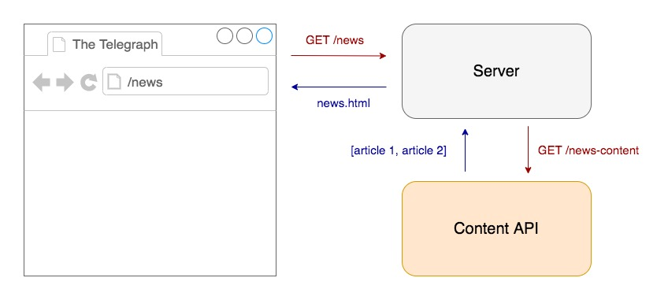
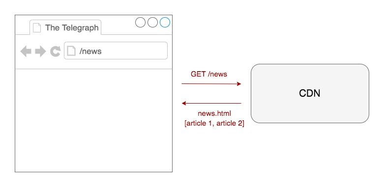

# Preact

## Objectives

Preact is small, lightweight Javascript framework (3kb). On the client-side, functionality such as reactivity and state management can be leveraged with little overhead.

It supports [static rendering](https://preactjs.com/cli/pre-rendering/) out of the box and [server-side rendering](https://preactjs.com/guide/v10/server-side-rendering/) using a plugin. When using the [cli](https://github.com/preactjs/preact-cli) it has a pre-configured service worker.

## POC

- Project repo: [https://github.com/chrisboakes/preact-demo](https://github.com/chrisboakes/preact-demo)
- Built project: [https://preact-demo-poc.herokuapp.com/](https://preact-demo-poc.herokuapp.com/)

I used the [preact-cli](https://github.com/preactjs/preact-cli) to prototype this POC (using the [default theme](https://github.com/preactjs-templates/default)) and used some dummy data to imitate the content API.

This POC is a mixture of statically generated, server-side rendered and client side rendered data:

- [Static rendering](#Static-Rendering): the home page
- [Server-side rendering](#Server-Side-Rendering): the politics page and the politics articles
- [Client-side rendering](#Client-Side-Rendering): the news page and the news articles

## Outcome

### Pros

- Client-side is lightweight and tiny - small overhead for a lot of features
- Intuitive component structure is easy to reuse modules of functionality
- Nice separation of CSS and JavaScript (CSS sits in its own file)
- Data binding/state management is helpful if content is being updated on the fly

### Cons

- Seems easiest to work with client-side. SSR was difficult to implement and not well documented. Required almost a custom approach to render data this way.
- Could not stop the page from double painting on SSR'd pages. The DOM loads the content from the server, then Preact kicks in on the client-side and hydrates the DOM causing a double paint.
- Cannot make server side call from component itself. It must be done on the server route config (see `server.js` in the repo) and passed into the component.
- Writing HTML in JavaScript feels awkward
- Googling for answers/information was difficult because it predominantly returned *React* information rather than *Preact*

## Further research

- Dynamic `<title>` and metadata
- Caching mechanism via service workers needs more exploration
- Offline caching
- Stopping double paint (if possible)
- Implement a scalable SSR solution

## Resources

- [Preact Docs](https://preactjs.com/guide/v10/api-reference)
- [Preact Github](https://github.com/preactjs/preact)
- [Preact Render To String](https://github.com/preactjs/preact-render-to-string)
- [Preact PWA](https://preactjs.com/guide/v10/progressive-web-apps/)
- [Approach to SSR](https://www.youtube.com/watch?v=qJyKZ6txShU) (preceded by this [React tutorial](https://www.youtube.com/watch?v=82tZAPMHfT4))
- componentWillMount vs componentDidMount [lifecycle explanation](https://daveceddia.com/where-fetch-data-componentwillmount-vs-componentdidmount/)
- [Patterns for data fetching](https://blog.logrocket.com/patterns-for-data-fetching-in-react-981ced7e5c56/) in React (same approach can be applied to Preact)

## Rendering Types

[This article](https://developers.google.com/web/updates/2019/02/rendering-on-the-web) gives an overview of the different rendering types.

### Server-Side Rendering

The request is made to the server which makes a call to the Content API, once it has a response it returns the data to the server and the server returns the HTML to the browser.



### Client-Side Rendering

The intial request for HTML is made to the CDN which returns HTML without any content. After the HTML has been rendered by the browser a call is made via JavaScript to fetch the content from the content API which is then appended into the markup.


### Static Rendering

Before the application is deployed, when the project is being compiled, all of the requests to the content API are made and compiled to HTML files which can served back quickly from a CDN.



# Running the project

``` bash
# install dependencies
npm install

# serve with hot reload at localhost:8080
npm run dev

# build for production with minification
npm run build

# test the production build locally
npm run serve

# run tests with jest and preact-render-spy 
npm run test
```

For detailed explanation on how things work, check out the [CLI README](https://github.com/developit/preact-cli/blob/master/README.md).
